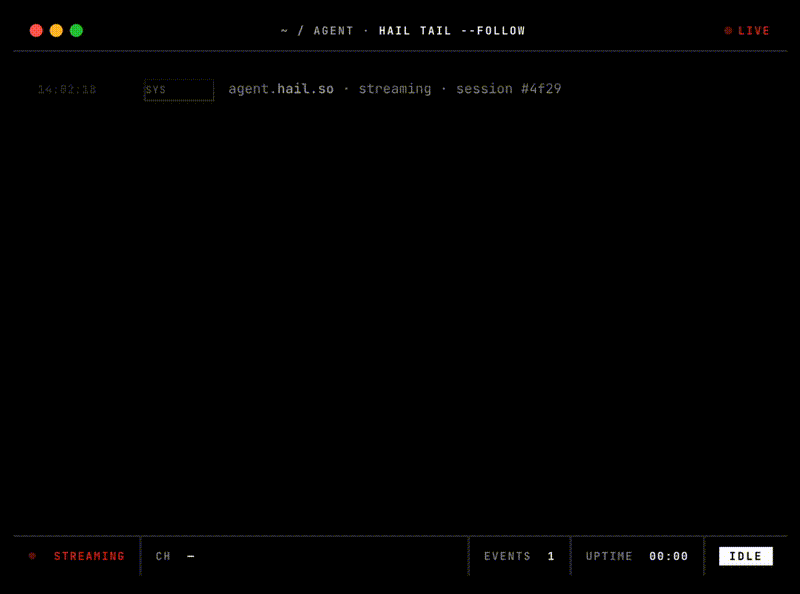

# Hail

> Universal communication platform for AI agents.
> Phone calls, SMS, email — outbound first, inbound next. Self-hostable. Open source (AGPLv3).

Your agent wants to place a call: _"Call +1… and ask if they want to reschedule."_ Hail does the carrier glue, runs the voice pipeline, and lets the agent plug in its own brain (or fall back to OpenAI → Gemini → Claude).

## Quickstart

```bash
git clone https://github.com/hail-hq/hail
cd hail
cp .env.example .env
# fill in Twilio, LiveKit Cloud, Deepgram, Cartesia, and one of OpenAI / Gemini / Anthropic
docker compose up
```

Authenticate:

- **Hail Cloud** (managed at hail.so): `hail login` runs the device-flow and saves an API key to `~/.hail/credentials.json`.
- **Self-host**: seed an API key directly into your local stack — see [docs/operations.md](docs/operations.md) "First-run DB seed". Then export `HAIL_API_KEY` (or pass `--api-key`).

Use it:

```bash
# CLI (for humans scripting Hail)
hail call +15551234567 --prompt "You are calling to confirm a reschedule."
hail email send --to alice@example.com --subject "hi" --body "hello from Hail"
hail tail                                # follow every event in your org
hail tail --id call:<uuid>               # narrow to one call

# HTTP
curl -X POST http://localhost:8080/calls \
  -H "Authorization: Bearer $HAIL_API_KEY" \
  -d '{"to":"+15551234567","system_prompt":"..."}'

curl -X POST http://localhost:8080/emails \
  -H "Authorization: Bearer $HAIL_API_KEY" \
  -d '{"to":["alice@example.com"],"subject":"hi","body_text":"hello"}'

# MCP (for AI agents — Claude.ai, ChatGPT, Claude Code, Cursor, …)
# Add a remote MCP connector in your client pointing at:
#   http://<your-host>:8081    (self-hosted)
#   https://mcp.hail.so        (Hail Cloud, later)
```

`hail tail` in action:



Full setup: [docs/setup/twilio.md](docs/setup/twilio.md), [docs/setup/livekit-cloud.md](docs/setup/livekit-cloud.md), [docs/setup/aws-ses.md](docs/setup/aws-ses.md), [docs/setup/mcp.md](docs/setup/mcp.md).

## Tenets

1. **Clear comms.** Explicit OpenAPI contracts. No magic.
2. **Simple code.** Boring is best. No abstractions without two uses.
3. **Brief docs.** One screen per page. Setup ≤ 10 minutes from a fresh clone.
4. **Self-hostable.** `docker compose up` runs everything except LiveKit Cloud.
5. **Pluggable brain.** BYO endpoint compatible with OpenAI's completions API, or use Hail's bundled fallback (OpenAI → Gemini → Anthropic). Voice pipeline + transport are always Hail's.
6. **Agent-first docs.** AI agents are first-class readers. Lead with concrete, runnable examples; link to canonical sources (OpenAPI spec, MCP tool schemas, code paths) rather than paraphrase them. Every page should let a reader — human or agent — take the next action.

## Milestones

Checked = shipped. Per-artifact changelogs (GitHub Releases for the CLI, PyPI release notes for the SDK) own the "shipped in which version" question.

### Phone calls

- Outbound
  - [x] Twilio
  - [ ] Telnyx
- Inbound
  - [ ] Twilio

### SMS

- Outbound
  - [ ] Twilio
- Inbound
  - [ ] Twilio

### Email

- Outbound
  - [x] AWS SES
  - [x] Custom sender domains (own DNS, auto DKIM + MAIL FROM)
- Inbound
  - [x] AWS SES
  - [x] Custom domains (receive on verified domains)

### Voice pipeline

- STT
  - [x] Deepgram
  - [ ] Whisper
  - [ ] AssemblyAI
- TTS
  - [x] Cartesia
  - [x] ElevenLabs
  - [ ] Deepgram Aura
- VAD
  - [x] Silero
- Turn detection
  - [x] LiveKit turn-detector
- LLM — system-prompt mode
  - [x] Fallback: OpenAI → Gemini → Anthropic, fast models
- LLM — BYO-endpoint mode
  - [x] OpenAI chat-completions-compatible
- Recording
  - [ ] S3 upload
  - [ ] Diarization

### Distribution

- API
  - [x] OpenAPI spec
- CLI
  - [x] `hail` binary via GitHub Releases
- MCP server
  - [x] Remote Streamable HTTP endpoint bundled with every Hail deploy
  - ~~PyPI stdio package~~ — intentionally not shipped; see [docs/setup/mcp.md](docs/setup/mcp.md)
- Python SDK
  - [x] `hail-sdk` on PyPI, imports as `hail`

### Infrastructure

- [x] Docker Compose scaffold
- Self-hosted LiveKit SFU
  - [ ] docker compose integration

## Architecture

```
AI agent ──► Hail API ──dispatch──► Voicebot ──► LiveKit Cloud ──SIP──► Twilio ──► 📞
```

Full diagram: [docs/architecture.md](docs/architecture.md).

## Contributing

See [docs/contributing.md](docs/contributing.md). TL;DR: fork, branch, conventional-commit, PR. Provider adapters go in `core/hailhq/core/providers/`. Update `.env.example` for any new env var.

## License

Source code: [AGPL-3.0-or-later](./LICENSE) — if you run a modified Hail as a service, you must release your source.
Pricing dataset (`costs/`): [CC-BY-4.0](./costs/LICENSE) — reuse the pricing JSON freely with attribution.
